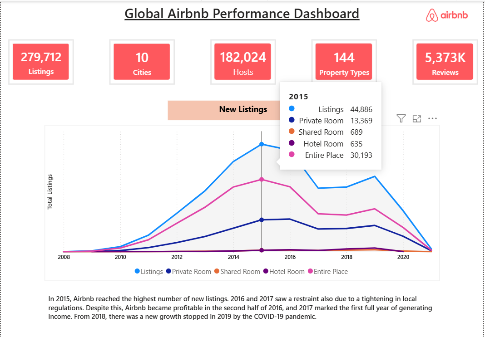
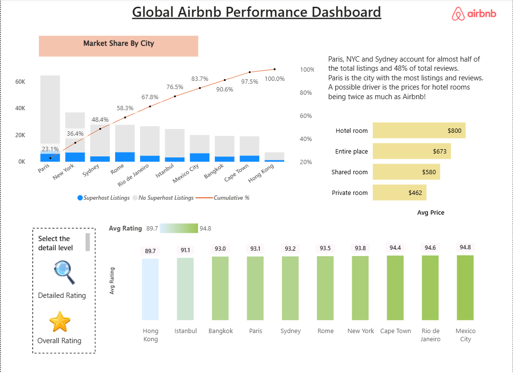

# 📊 Global Airbnb Performance Dashboard

A comprehensive Power BI analytics report examining global Airbnb listings, market share, listing growth over time, host verification dynamics, and customer review behavior across major world cities.

---

## 📌 Executive Summary KPIs

* **Total Listings:** 279,712
* **Total Cities Analyzed:** 10 major global hubs
* **Total Hosts:** 182,024
* **Property Types:** 144 distinct room and home categories
* **Total Reviews Analyzed:** 5,373,000+

---

## 🖼️ Dashboard Overview & Key Visuals

### 1. Market Growth & Property Types Overview
Analyzes listing expansion over time and tracks structural shifts across property types.



* **Key Takeaway:** Listing growth peaked in 2015 (with 44,886 new listings added), followed by a period of regulation-driven stabilization in 2016–2017. A secondary growth wave occurred in 2018–2019 prior to the 2020 pandemic dip.

---

### 2. Market Share & Pricing Analysis
Compares city-level concentration, Superhost presence, average pricing, and rating distribution.



* **Market Concentration:** Top destinations (Paris, NYC, and Sydney) represent nearly **50% of all global listings** and **48% of total customer reviews**.
* **Price Differentials:** Hotel rooms average **$800/night**, whereas Entire Places average **$673/night**, Private Rooms **$462/night**, and Shared Rooms **$580/night**.
* **Ratings Range:** Average ratings span from **89.7** (Hong Kong) to **94.8** (Mexico City).

---

### 3. Reviewer Behavior & Trust Dynamics
Examines review frequency, seasonal patterns, and user verification trust metrics.


* **Review Frequency:** **98.8%** of reviewers leave 3 or fewer reviews overall.
* **Seasonality:** Paris and Rome dominate review activity during European summer peak months (April to August), while New York experiences demand surges in November and December.
* **Host Trust:** **66.9%** of hosts maintain both a verified identity and a completed profile picture.

---

## 🛠️ Tools & Technologies Used

* **Business Intelligence:** Power BI Desktop
* **Version Control:** Git & Git LFS (Large File Storage)
* **Data Sources:** Airbnb Open Data / Historical Performance Datasets

---

## 📂 Repository Structure

```text
├── airbnb.pbix         # Interactive Power BI Report File (Git LFS)
├── Overview.png        # Dashboard Screenshot 1
├── Ratings.png         # Dashboard Screenshot 2
├── Reviews.jpg         # Dashboard Screenshot 3
└── README.md           # Documentation
